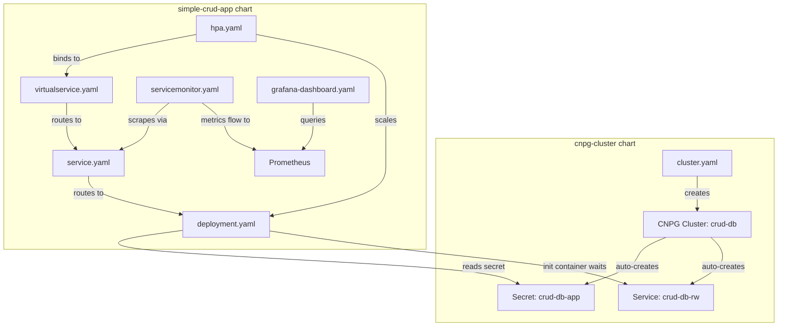

# Helm Charts Documentation

Detailed line-by-line documentation for every file in the `helm/` directory.

---

## Chart 1: `cnpg-cluster` (PostgreSQL Database)

| File | Description |
|------|-------------|
| [Chart.yaml](cnpg-cluster/chart-yaml.md) | Chart metadata — API version, name, type, versioning |
| [values.yaml](cnpg-cluster/values-yaml.md) | Default configuration — instances, storage, resources, monitoring |
| [templates/_helpers.tpl](cnpg-cluster/helpers-tpl.md) | Reusable named templates — name generation, standard labels |
| [templates/cluster.yaml](cnpg-cluster/cluster-yaml.md) | CNPG Cluster custom resource — bootstrap, storage, monitoring |
| [templates/podmonitor.yaml](cnpg-cluster/podmonitor-yaml.md) | PodMonitor — Prometheus scrape config for CNPG |

---

## Chart 2: `simple-crud-app` (FastAPI Application)

| File | Description |
|------|-------------|
| [Chart.yaml](simple-crud-app/chart-yaml.md) | Chart metadata — API version, name, type, versioning |
| [values.yaml](simple-crud-app/values-yaml.md) | Default configuration — image, service, ingress, autoscaling, database, monitoring |
| [templates/_helpers.tpl](simple-crud-app/helpers-tpl.md) | Reusable named templates — name, fullname, labels, selectorLabels |
| [templates/deployment.yaml](simple-crud-app/deployment-yaml.md) | Deployment — init container, env vars, sed URL rewrite, health probes |
| [templates/service.yaml](simple-crud-app/service-yaml.md) | Service — port mapping, selector labels, traffic routing |
| [templates/virtualservice.yaml](simple-crud-app/virtualservice-yaml.md) | Istio VirtualService — hostname routing, path matching |
| [templates/gateway.yaml](simple-crud-app/gateway-yaml.md) | Istio Gateway — exposes application at edge of mesh |
| [templates/hpa.yaml](simple-crud-app/hpa-yaml.md) | HorizontalPodAutoscaler — CPU-based autoscaling |
| [templates/servicemonitor.yaml](simple-crud-app/servicemonitor-yaml.md) | ServiceMonitor — Prometheus scrape configuration |
| [templates/grafana-dashboard.yaml](simple-crud-app/grafana-dashboard-yaml.md) | Grafana dashboard — JSON model, PromQL queries, grid layout, escaping |

---

## How the Two Charts Connect

Both charts must be deployed in the **same namespace** (e.g., `crud`) for the database connection to work.
