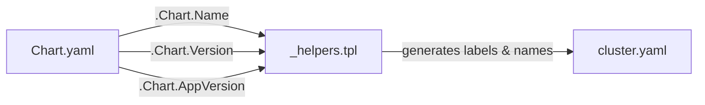

# cnpg-cluster / Chart.yaml — Line-by-Line Documentation

**File:** [Chart.yaml](file:///home/selva/Documents/Terraform/simple_crud_app/helm/cnpg-cluster/Chart.yaml)

---

## What is Chart.yaml?

Every Helm chart **must** contain a `Chart.yaml` file. It is the chart's identity card — Helm reads this file to understand the chart's name, version, and type. Without it, Helm refuses to treat the directory as a chart.

---

## Full File with Annotations

```yaml
# Line 1
apiVersion: v2
```

- **What:** Declares the Helm chart API version.
- **`v2`** means this chart uses the **Helm 3** format. The older `v1` was for Helm 2 charts.
- **Why it matters:** Helm 3 introduced breaking changes (no more Tiller, different dependency format). Setting `v2` tells Helm to use the v3 parser.
- **Rule:** Always use `v2` for new charts. Helm 3 can still read `v1` charts, but `v2` is recommended.

---

```yaml
# Line 2
name: cnpg-cluster
```

- **What:** The name of this Helm chart.
- **Used in:**
  - `helm install <release-name> <chart-path>` — identifies the chart.
  - Template helpers — `{{ .Chart.Name }}` resolves to `cnpg-cluster`.
  - Default resource naming — if no `nameOverride` is set, resources derive their names from this.
- **Naming rules:** Must be lowercase, may contain `-` and `.`, max 63 characters.

---

```yaml
# Line 3
description: CloudNativePG PostgreSQL cluster for the CRUD app
```

- **What:** A human-readable summary of what this chart deploys.
- **Where it appears:**
  - `helm search repo` output.
  - `helm show chart <chart>` output.
  - Artifact Hub / chart repository listings.
- **Best practice:** Keep it short (one line) but descriptive enough to understand the chart's purpose without reading the source.

---

```yaml
# Line 4
type: application
```

- **What:** Declares whether this chart deploys Kubernetes resources or is a reusable template library.
- **Two possible values:**

| Type | Meaning | Creates resources? | Example |
|------|---------|-------------------|---------|
| `application` | Deploys actual Kubernetes objects (Pods, Services, etc.) | ✅ Yes | This chart, nginx chart |
| `library` | Only provides helper templates for other charts to use | ❌ No | Common labels library |

- **This chart** is `application` because it creates a CloudNativePG `Cluster` resource.

---

```yaml
# Line 5
version: 0.1.0
```

- **What:** The chart's own version number — follows [Semantic Versioning](https://semver.org/) (`MAJOR.MINOR.PATCH`).
- **When to bump:**
  - **PATCH** (`0.1.0` → `0.1.1`): Bug fixes, comment changes, minor tweaks.
  - **MINOR** (`0.1.0` → `0.2.0`): New features (e.g., adding backup configuration).
  - **MAJOR** (`0.1.0` → `1.0.0`): Breaking changes (e.g., restructuring `values.yaml`).
- **Important:** This is the **chart version**, not the application version. They are tracked independently.
- **Used by:** `helm list` (shows chart version), `helm history`, chart repositories.

---

```yaml
# Line 6
appVersion: "16"
```

- **What:** The version of the application **inside** the chart — here, PostgreSQL 16.
- **Quoted as a string** (`"16"`) because Helm expects `appVersion` to be a string. Unquoted `16` would be parsed as an integer, which could cause issues.
- **Does NOT affect deployment.** This is purely informational — it does not change the Docker image tag or any resource. The actual image is controlled by `values.yaml` → `cluster.imageName`.
- **Where it appears:** `helm list` output (the `APP VERSION` column).
- **Best practice:** Keep it in sync with the actual PostgreSQL version used in `values.yaml`.

---

## Relationship to Other Files



- `_helpers.tpl` reads `{{ .Chart.Name }}` (→ `cnpg-cluster`) to generate resource names.
- `_helpers.tpl` reads `{{ .Chart.Version }}` and `{{ .Chart.AppVersion }}` for labels (though this chart's helpers don't use AppVersion).
- `cluster.yaml` uses the helpers, so it indirectly depends on `Chart.yaml`.
