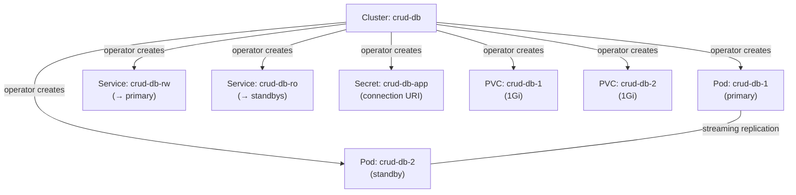

# cnpg-cluster / templates/cluster.yaml — Documentation

**File:** [cluster.yaml](file:///home/selva/Documents/Terraform/simple_crud_app/helm/cnpg-cluster/templates/cluster.yaml)

---

## What Does This File Create?

A **CloudNativePG `Cluster`** custom resource. When applied, the CNPG operator (which must be pre-installed) detects it and automatically provisions PostgreSQL pods, services, secrets, and persistent volumes.

---

## Line-by-Line Explanation

```yaml
# Line 1
apiVersion: postgresql.cnpg.io/v1
```

- **Custom API group** registered by the CNPG operator CRD (Custom Resource Definition).
- This is NOT a built-in Kubernetes API — it only works when the CNPG operator is installed.
- `v1` = stable API version of the CNPG Cluster resource.

---

```yaml
# Line 2
kind: Cluster
```

- The CRD type. Tells Kubernetes "this is a CNPG Cluster resource."
- The CNPG operator has a controller watching for resources of this kind.

---

```yaml
# Lines 3-6
metadata:
  name: {{ include "cnpg-cluster.name" . }}
  labels:
    {{- include "cnpg-cluster.labels" . | nindent 4 }}
```

- **`name`** — Calls the `cnpg-cluster.name` helper → `crud-db`.
- **`labels`** — Calls the `cnpg-cluster.labels` helper → injects `app.kubernetes.io/name`, `instance`, `managed-by`.
- **`| nindent 4`** — Adds a newline and indents labels by 4 spaces to align under `labels:`.

---

```yaml
# Lines 7-9
spec:
  instances: {{ .Values.cluster.instances }}
  imageName: {{ .Values.cluster.imageName }}
```

- **`spec:`** — The desired state for the CNPG cluster.
- **`instances: 2`** — CNPG creates 2 PostgreSQL pods: 1 primary (read-write) + 1 standby (streaming replica). The operator handles failover automatically.
- **`imageName`** — The PostgreSQL container image. Uses the CNPG-maintained image which includes backup/restore tooling.

---

```yaml
# Lines 10 (blank line)
```

---

```yaml
# Lines 11-14
  bootstrap:
    initdb:
      database: {{ .Values.cluster.database }}
      owner: {{ .Values.cluster.owner }}
```

- **`bootstrap`** — Defines how the cluster is initialized on **first creation only**.
- **`initdb`** — Uses PostgreSQL's `initdb` method (as opposed to recovery from backup or `pg_basebackup` from another cluster).
- **`database: crud_db`** — Creates this database during initialization. Equivalent to running `CREATE DATABASE crud_db;`.
- **`owner: app`** — Creates a PostgreSQL role named `app` and makes it the owner of `crud_db`. CNPG generates a random password and stores it in Secret `crud-db-app`.

> [!NOTE]
> The `bootstrap` section is **idempotent** — if the cluster already exists, CNPG ignores it. You cannot add a new database by changing this value and running `helm upgrade`. Use `psql` or a migration tool instead.

---

```yaml
# Lines 15 (blank line)
```

---

```yaml
# Lines 16-20
  storage:
    size: {{ .Values.cluster.storage.size }}
    {{- if .Values.cluster.storage.storageClass }}
    storageClass: {{ .Values.cluster.storage.storageClass }}
    {{- end }}
```

- **`storage:`** — PVC configuration for each PostgreSQL instance.
- **`size: 1Gi`** — Each pod gets a 1 GiB PersistentVolumeClaim for the PostgreSQL data directory.
- **Lines 18-20: Conditional storageClass** — The `if` block only renders `storageClass:` when the value is non-empty. An empty string (`""`) in values.yaml means "use the cluster default StorageClass." If we rendered `storageClass: ""` literally, Kubernetes would NOT fall back to the default — it would fail. So the template omits the field entirely.

---

```yaml
# Lines 21 (blank line)
```

---

```yaml
# Lines 22-23
  resources:
    {{- toYaml .Values.cluster.resources | nindent 4 }}
```

- **`toYaml`** — Converts the `resources` object from values.yaml into raw YAML text.
- **`| nindent 4`** — Indents the output by 4 spaces (to be under `resources:` properly).
- **Why `toYaml` instead of individual fields?** It passes through the entire `requests`/`limits` structure unchanged, so you don't need to template each field individually. Adding new resource types (like `hugepages`) in values.yaml would automatically work.

**Rendered output:**
```yaml
  resources:
    requests:
      cpu: 100m
      memory: 256Mi
    limits:
      cpu: "1"
      memory: 512Mi
```

---

```yaml
# Lines 24 (blank line)
```

---

```yaml
# Lines 25-28
  {{- if .Values.cluster.monitoring.enabled }}
  monitoring:
    enablePodMonitor: false
  {{- end }}
```

- **Conditional block** — Only adds the `monitoring` section when `monitoring.enabled` is `true` in values.yaml.
- **`enablePodMonitor: false`** — This is explicitly set to `false` as a workaround for an ArgoCD drift issue.
- **Why `false`?** The CNPG operator's mutating webhook injects `enablePodMonitor: false` into the cluster resource at runtime if a PodMonitor isn't explicitly requested or created. If we use `{}` or omit it, ArgoCD sees a difference between the Git state (empty/omitted) and the cluster state (`enablePodMonitor: false`) and continuously tries to sync the app, causing an infinite loop. Setting it explicitly to `false` matches the operator's runtime mutation and stabilizes ArgoCD.

---

## What the CNPG Operator Creates When This is Applied


