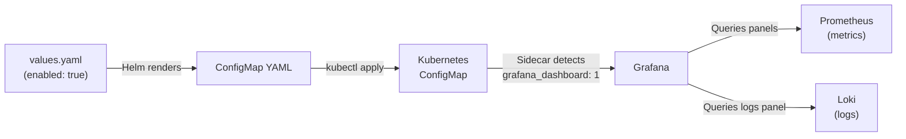

# Grafana Dashboard — Detailed Explanation

This document explains every part of [grafana-dashboard.yaml](file:///home/selva/Documents/Terraform/simple_crud_app/helm/simple-crud-app/templates/grafana-dashboard.yaml) so you can confidently read, modify, or extend it.

---

## 1 — The Three Layers

The file contains **three nested layers**. Understanding this is the key to reading it:

```
┌─────────────────────────────────────────────┐
│  Layer 1: Helm Template Directives          │  ← Lines 1-3, 116
│  ┌─────────────────────────────────────────┐│
│  │  Layer 2: Kubernetes ConfigMap (YAML)   ││  ← Lines 4-12
│  │  ┌─────────────────────────────────────┐││
│  │  │  Layer 3: Grafana Dashboard (JSON)  │││  ← Lines 13-115
│  │  └─────────────────────────────────────┘││
│  └─────────────────────────────────────────┘│
└─────────────────────────────────────────────┘
```

| Layer | Language | Purpose |
|-------|----------|---------|
| **1 — Helm** | Go template `{{ }}` | Conditionally renders the file and injects dynamic values (app name, namespace) |
| **2 — ConfigMap** | YAML | The Kubernetes resource that stores the dashboard JSON as data |
| **3 — Dashboard** | JSON (embedded inside YAML via `\|`) | The actual Grafana dashboard model that Grafana imports |

---

## 2 — Layer 1: Helm Template Directives (Lines 1–3, 116)

```yaml
{{- if .Values.monitoring.grafana.dashboards.enabled }}   # Line 1
{{- $fullname := include "simple-crud-app.fullname" . -}} # Line 2
{{- $name := include "simple-crud-app.name" . -}}         # Line 3
...
{{- end }}                                                 # Line 116
```

| Line | What it does |
|------|--------------|
| **1** | **Guard**: The entire file is only rendered if `monitoring.grafana.dashboards.enabled` is `true` in `values.yaml`. If false, Helm produces no output at all. |
| **2** | **Variable**: Calls the `simple-crud-app.fullname` helper (defined in `_helpers.tpl`) and stores the result in `$fullname`. This is typically `<release-name>-simple-crud-app`. Used later inside PromQL queries. |
| **3** | **Variable**: Stores the shorter app name (e.g., `simple-crud-app`) in `$name`. Used in the Loki log query. |
| **116** | Closes the `if` block. |

> [!TIP]
> The `{{-` syntax (with a dash) trims whitespace before the tag. This prevents blank lines in the rendered YAML output.

---

## 3 — Layer 2: Kubernetes ConfigMap (Lines 4–12)

```yaml
apiVersion: v1              # Line 4  — Kubernetes API version
kind: ConfigMap             # Line 5  — Resource type
metadata:                   # Line 6
  name: {{ $fullname }}-dashboard   # Line 7  — e.g., "myrelease-simple-crud-app-dashboard"
  labels:                   # Line 8
    {{- include "simple-crud-app.labels" . | nindent 4 }}  # Line 9  — Standard Helm labels
    grafana_dashboard: "1"  # Line 10 — ⭐ Magic label (see below)
data:                       # Line 11
  fastapi-crud.json: |      # Line 12 — File name inside the ConfigMap
```

> [!IMPORTANT]
> **`grafana_dashboard: "1"` (Line 10)** — This label is how the Grafana sidecar discovers this ConfigMap. The Grafana Helm chart deploys a sidecar container that watches for ConfigMaps with this label. When it finds one, it automatically loads the JSON inside as a dashboard. Without this label, Grafana would never see this dashboard.

### The `|` (pipe) on Line 12

The `|` is a YAML **literal block scalar**. It tells YAML: "everything indented below this is a single multi-line string — preserve newlines exactly as-is." This is how we embed the JSON blob verbatim inside a YAML field.

---

## 4 — Layer 3: Grafana Dashboard JSON (Lines 13–115)

This is the actual dashboard definition. Let's break it into sections.

### 4.1 — Dashboard-Level Settings (Lines 13–19)

```json
{
  "description": "Comprehensive monitoring dashboard for the FastAPI CRUD application...",
  "annotations": { "list": [] },
  "editable": true,
  "fiscalYearStartMonth": 0,
  "graphTooltip": 1,
  "links": [],
```

| Key | Type | Meaning |
|-----|------|---------|
| `description` | string | Text shown when you click the dashboard info icon (ⓘ) in Grafana |
| `annotations` | object | Grafana annotations (event markers on graphs). Empty list = none defined |
| `editable` | bool | `true` = users can modify the dashboard via the Grafana UI |
| `fiscalYearStartMonth` | int | `0` = January. Only matters if you use fiscal year–based time ranges |
| `graphTooltip` | int | Controls tooltip behavior across panels: `0` = per-panel, **`1` = shared crosshair** (hovering on one graph shows the same timestamp on all graphs), `2` = shared tooltip |
| `links` | array | Dashboard-level links (e.g., to external docs). Empty = none |

### 4.2 — The `panels` Array (Lines 20–108)

This is the core of the dashboard. Each object in the `panels` array is **one visual widget** on the dashboard.

Every panel has these common fields:

```json
{
  "title": "...",
  "description": "...",
  "type": "...",
  "gridPos": { "h": ..., "w": ..., "x": ..., "y": ... },
  "targets": [ ... ]
}
```

| Field | Meaning |
|-------|---------|
| `title` | Display name shown at the top of the panel |
| `description` | Hover tooltip text (the ⓘ icon on the panel) |
| `type` | The Grafana visualization plugin: `timeseries` (line chart), `stat` (single number), `logs` (log viewer) |
| `gridPos` | Position and size on the dashboard grid (explained below) |
| `targets` | The data queries — where the panel gets its data from |

---

### 4.3 — Understanding `gridPos` (The Layout Grid)

Grafana uses a **24-column grid**. Think of it like a spreadsheet:

```
Column:  0    6    12   18   24
         ├────┼────┼────┼────┤
Row 0  → │         │         │   ← Request Rate (w=12) | Duration (w=12)
         │         │         │
Row 8  → │    │    │              ← Active Requests (w=6) | Error Rate (w=6)
Row 12 → │                   │   ← Pod Logs (w=24, full width)
         │                   │
Row 20 → │         │         │   ← CNPG TPS (w=12) | CNPG Lag (w=12)
```

| Field | Meaning | Example |
|-------|---------|---------|
| `h` | Height in grid units | `8` = 8 rows tall |
| `w` | Width in grid columns (out of 24) | `12` = half width, `24` = full width, `6` = quarter width |
| `x` | Horizontal position (0 = left edge) | `12` = starts at the middle |
| `y` | Vertical position (0 = top) | `8` = starts below an 8-unit-tall panel |

Here's how all 7 panels are laid out:

| Panel | `h` | `w` | `x` | `y` | Position on screen |
|-------|-----|-----|-----|-----|--------------------|
| Request Rate | 8 | 12 | 0 | 0 | Top-left half |
| Request Duration (p95) | 8 | 12 | 12 | 0 | Top-right half |
| Active Requests | 4 | 6 | 0 | 8 | Second row, left quarter |
| Error Rate (5xx) | 4 | 6 | 6 | 8 | Second row, second quarter |
| Pod Logs | 8 | 24 | 0 | 12 | Third row, **full width** |
| CNPG — TPS | 8 | 12 | 0 | 20 | Fourth row, left half |
| CNPG — Replication Lag | 8 | 12 | 12 | 20 | Fourth row, right half |

---

### 4.4 — Panel 1: Request Rate (Lines 21–31)

```json
"expr": "sum(rate(http_request_duration_seconds_count{service=\"{{ $fullname }}\"}[5m])) by (method, handler, status)"
```

**PromQL breakdown:**

| Fragment | Meaning |
|----------|---------|
| `http_request_duration_seconds_count` | A Prometheus counter — total number of HTTP requests observed (it's the `_count` component of a histogram) |
| `{service=\"{{ $fullname }}\"}` | Filter: only include metrics where the `service` label matches your app's full name |
| `[5m]` | Look at the last 5 minutes of data |
| `rate(... [5m])` | Calculate the per-second rate of increase (converts a counter into "requests per second") |
| `sum(...) by (method, handler, status)` | Group the results by HTTP method (`GET`, `POST`), route handler (`/items`, `/health`), and status code (`200`, `404`, `500`) |

**Legend format:**
```json
"legendFormat": "{{`{{method}}`}} {{`{{handler}}`}} {{`{{status}}`}}"
```
This produces legend labels like: `GET /items 200`, `POST /items 201`

> [!NOTE]
> **Why `{{` + `` ` `` + `{{method}}` + `` ` `` + `}}`?**
>
> This is a Helm escaping trick. Grafana uses `{{method}}` as its own template syntax to insert label values into legends. But Helm ALSO uses `{{ }}` and would try to evaluate `{{method}}` as a Go template — which would fail.
>
> The solution: wrap the Grafana mustache in a Go raw string literal: `` {{`{{method}}`}} ``
> - The outer `{{ }}` is Helm
> - `` ` `` starts/ends a Go raw string literal
> - `{{method}}` inside the raw string is passed through verbatim
> - **Result after Helm rendering:** `{{method}}` — exactly what Grafana expects

---

### 4.5 — Panel 2: Request Duration p95 (Lines 33–43)

```json
"expr": "histogram_quantile(0.95, sum(rate(http_request_duration_seconds_bucket{service=\"{{ $fullname }}\"}[5m])) by (le, handler))"
```

**PromQL breakdown (inside-out):**

| Step | Fragment | Meaning |
|------|----------|---------|
| 1 | `http_request_duration_seconds_bucket` | The histogram bucket counter — Prometheus stores request durations in predefined buckets (e.g., ≤0.01s, ≤0.05s, ≤0.1s, etc.) |
| 2 | `{service=\"{{ $fullname }}\"}` | Filter to your app |
| 3 | `rate(... [5m])` | Per-second rate of bucket increments |
| 4 | `sum(...) by (le, handler)` | Group by `le` (bucket upper bound, required for histograms) and `handler` (the route) |
| 5 | `histogram_quantile(0.95, ...)` | From the bucket distribution, calculate the value below which 95% of observations fall |

**In plain English:** "For each route, what is the response time that 95% of requests are faster than?"

> [!TIP]
> The `le` label (short for "less than or equal") is mandatory in the `by` clause when using `histogram_quantile`. It represents the bucket boundaries. Grafana needs it to interpolate the quantile value.

---

### 4.6 — Panel 3: Active Requests (Lines 45–54)

```json
"expr": "sum(http_requests_in_progress{service=\"{{ $fullname }}\"})"
```

| Fragment | Meaning |
|----------|---------|
| `http_requests_in_progress` | A Prometheus **gauge** (not a counter). It goes up and down, representing the current number of requests being handled right now |
| `sum(...)` | Sum across all pods/instances to get the total in-flight count |

**Panel type: `stat`** — Renders as a single large number (e.g., `42`).

---

### 4.7 — Panel 4: Error Rate 5xx (Lines 56–65)

```json
"expr": "sum(rate(http_request_duration_seconds_count{service=\"{{ $fullname }}\", status=~\"5..\"}[5m]))"
```

| Fragment | Meaning |
|----------|---------|
| `status=~\"5..\"` | **Regex match** (`=~`): matches any status starting with `5` followed by any two characters → `500`, `502`, `503`, `504`, etc. |
| Everything else | Same as Panel 1: rate of requests per second, but filtered to only server errors |

**In plain English:** "How many 5xx errors per second are we producing right now?"

---

### 4.8 — Panel 5: Pod Logs (Lines 67–83)

This panel is different from the others — it uses **Loki** (a log aggregation system) instead of Prometheus.

```json
"expr": "{namespace=\"{{ .Release.Namespace }}\", app_kubernetes_io_name=\"{{ $name }}\"}",
"refId": "A"
```

| Fragment | Meaning |
|----------|---------|
| `{ }` | This is a **LogQL** stream selector (Loki's query language), not PromQL |
| `namespace=\"{{ .Release.Namespace }}\"` | Filter logs to the Helm release namespace |
| `app_kubernetes_io_name=\"{{ $name }}\"` | Filter logs to pods with this Kubernetes label |
| `refId` | Grafana's internal query reference ID |

**Additional fields unique to this panel:**

```json
"options": {
  "showTime": true,           // Show timestamp for each log line
  "sortOrder": "Descending",  // Newest logs first
  "enableLogDetails": true    // Allow expanding a log line to see all labels
},
"datasource": { "type": "loki", "uid": "loki" }
```

> [!IMPORTANT]
> **`datasource`** — This panel explicitly sets its datasource to Loki. All other panels omit this field, which means they use the **default datasource** (Prometheus). If your Loki datasource has a different UID, this must be updated.

---

### 4.9 — Panel 6: CNPG Transactions per Second (Lines 85–95)

```json
"expr": "sum(rate(cnpg_pg_stat_database_xact_commit{datname=\"crud_db\"}[5m]))"
```

| Fragment | Meaning |
|----------|---------|
| `cnpg_pg_stat_database_xact_commit` | A counter exposed by the CloudNativePG operator — total committed transactions in PostgreSQL |
| `{datname=\"crud_db\"}` | Filter to the `crud_db` database only |
| `rate(... [5m])` | Commits per second over the last 5 minutes |
| `sum(...)` | Sum across all replicas |

---

### 4.10 — Panel 7: CNPG Replication Lag (Lines 97–107)

```json
"expr": "cnpg_pg_replication_lag{namespace=\"{{ .Release.Namespace }}\"}",
"legendFormat": "{{`{{pod}}`}}"
```

| Fragment | Meaning |
|----------|---------|
| `cnpg_pg_replication_lag` | A gauge exposed by the CloudNativePG operator — replication lag in bytes between primary and standby |
| No `rate()` or `sum()` | This is a raw gauge; we want the actual current value, not a rate |
| `legendFormat: {{pod}}` | Each line in the graph is labeled with the pod name, so you can see which standby is lagging |

---

### 4.11 — Dashboard Footer Settings (Lines 109–115)

```json
"schemaVersion": 39,
"templating": { "list": [] },
"time": { "from": "now-1h", "to": "now" },
"title": "FastAPI CRUD App",
"uid": "fastapi-crud-app"
```

| Key | Meaning |
|-----|---------|
| `schemaVersion` | Grafana's internal dashboard format version. `39` corresponds to Grafana 10.x+. Grafana uses this to migrate older dashboards |
| `templating` | Dashboard variables (dropdowns at the top). Empty list = no variables defined |
| `time` | Default time range when the dashboard is opened: **last 1 hour** |
| `title` | The dashboard name displayed in Grafana's UI and sidebar |
| `uid` | A unique identifier for the dashboard. Used in URLs (`/d/fastapi-crud-app/...`) and for importing/updating. If you deploy a new version with the same UID, Grafana **updates** the existing dashboard instead of creating a duplicate |

---

## 5 — Understanding the Escaping (The Tricky Part)

There are **two escaping issues** in this file that often cause confusion:

### 5.1 — Double-Escaped Quotes: `\\\"`

In the JSON, you see things like:
```
{service=\\\"{{ $fullname }}\\\"}
```

Why? There are **two layers of escaping**:

| Layer | What it does | Example |
|-------|--------------|---------|
| **YAML** | The `\|` block scalar passes content verbatim — no YAML escaping needed | — |
| **JSON** | Inside a JSON string, `\"` is how you write a literal `"` | `\"` → `"` |
| **PromQL** | PromQL expects: `{service="my-app"}` | — |

So `\\\"{{ $fullname }}\\\"` renders as:
1. Helm replaces `{{ $fullname }}` → `myrelease-simple-crud-app`
2. JSON unescapes `\"` → `"`
3. **Final PromQL:** `{service="myrelease-simple-crud-app"}`

### 5.2 — The Raw String Trick: `` {{`{{handler}}`}} ``

```
"legendFormat": "{{`{{method}}`}} {{`{{handler}}`}} {{`{{status}}`}}"
```

| Step | What happens |
|------|--------------|
| Helm sees `{{` and starts processing | |
| It finds `` ` `` — this begins a Go **raw string literal** | |
| Everything between the backticks is passed through unchanged | `{{method}}` |
| Helm outputs the raw string as-is | |
| **Final JSON value:** | `{{method}} {{handler}} {{status}}` |
| Grafana then substitutes `{{method}}` with the actual label value | `GET /items 200` |

---

## 6 — Visual Summary: Data Flow



---

## 7 — Quick Reference: How to Add a New Panel

To add a new panel, insert a new object into the `panels` array. Use this template:

```json
{
  "title": "Your Panel Title",
  "description": "What this metric means and when to worry.",
  "type": "timeseries",
  "gridPos": { "h": 8, "w": 12, "x": 0, "y": 28 },
  "targets": [
    {
      "expr": "your_promql_query_here",
      "legendFormat": "{{`{{label_name}}`}}"
    }
  ]
}
```

> [!CAUTION]
> Make sure the `y` value doesn't overlap with existing panels. The last panel currently ends at `y=20 + h=8 = 28`, so new panels should start at `y: 28` or later.
